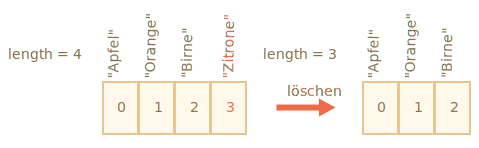

# Arrays

Objekte erlauben dir eine Sammlung von Werten mit Schlüssel zu speichern. Das ist gut soweit.

Jedoch brauchen wir oft eine *geordnete Sammlung*, bei der wir ein erstes, zweites, drittes, ... Element haben. Zum Beispiel können wir dies gebrauchen, um eine Liste von etwas zu speichern: Benutzer, Güter, HTML Elemente, etc.

In dieser Situation wäre ein Objekt ungeeignet, da es keine Methode bereitstellt, um die Reihenfolge der Elemente zu verwalten. Wir können keine neue Eigenschaft "zwischen" schon existierenden Eigenschaften einfügen. Objekte sind für solche einen Gebrauch einfach nicht gedacht.

Es existiert eine spezielle Datenstruktur namens `Array`, um geordnete Sammlungen zu speichern.

## Deklaration

Es gibt zwei Wege, um ein leeres Array zu erstellen:

```js
let arr = new Array();
let arr = [];
```

Meisten wird jedoch der zweite Weg gebraucht. Wir können schon erste Elemente in den eckigen Klammern mitlierfern:

```js
let fruechte = ["Apfel", "Orange", "Pflaume"];
```

Elemente in einem Array sind nummeriert, beginnend mit Null.

Wir können ein Element mit entsprechender Nummer in eckigen Klammern bekommen:

```js run
let fruechte = ["Apfel", "Orange", "Pflaume"];

alert( fruechte[0] ); // Apfel
alert( fruechte[1] ); // Orange
alert( fruechte[2] ); // Pflaume
```

Wir können Elemente ersetzen:

```js
fruechte[2] = 'Birne'; // jetzt ["Apfel", "Orange", "Birne"]
```

... Oder ein neues Element dem Array hinzufügen:

```js
fruechte[3] = 'Zitrone'; // jetzt ["Apfel", "Orange", "Birne", "Zitrone"]
```

Die Gesamtanzahl der Elemente in einem Array ist gespeichert in `lenght` (Länge):

```js run
let fruechte = ["Apfel", "Orange", "Pflaume"];

alert( fruechte.length ); // 3
```

Wir können `alert` benutzen, um das ganze Array anzeigen zu lassen:

```js run
let fruechte = ["Apfel", "Orange", "Pflaume"];

alert( fruechte ); // Apfel,Orange,Pflaume
```

Ein Array kann Element von jeglichem Typen speichern:

```js run no-beautify
// verschiedene Elemente
let arr = [ 'Apfel', { name: 'John' }, true, function() { alert('Hallo'); } ];

//hole das Objekt vom Index 1 und zeige seinen Namen an
alert( arr[1].name ); // John

//hole die Funktion vom Index 3 und lasse sie laufen
arr[3](); // Hallo
```


````smart header="Komma im Anhang"
Ein Array endet wie ein Objekt mit einem Komma:
```js
let fruechte = [
  "Apfel",
  "Orange",
  "Pflaume"*!*,*/!*
];
```

Dieser Style von den Kommas macht es einfacher Elemente hinzuzufügen/zu entfernen, da alle Linien ähnlich sind.
````


## Methoden pop/push, shift/unshift

Die [Warteschlange](https://de.wikipedia.org/wiki/Warteschlange_(Datenstruktur)), auch `queue` genannt, ist eines von den meist benötigten Arrays. In der Informatik bedeutet es soviel wie eine geordnete Sammlung von Elementen. Diese unterstützt die folgenden zwei Operationen:

- `push` fügt ein Element dem Ende hinzu.
- `shift` holt ein Element vom Anfang, rückt die Warteschlange vor, damit das zweite Element das erste wird.


Arrays unterstützen beide Operationen.

In praktischer Hinsicht brachen wir das sehr oft. Zum Beispiel, wenn eine Warteschlange bestehend aus Nachrichten auf dem Bildschirm angezeigt werden sollen.

Ein anderer Anwendungsfall für Arrays ist die Datenstruktur namens [Stapelspeicher](https://de.wikipedia.org/wiki/Stapelspeicher), auch `stack` genannt.

Dies unterstützt zwei Operationen:

- `push` fügt ein Element dem Ende hinzu.
- `pop` nimmt ein Element weg vom Ende.

In diesem Fall werden immer neue Elemente am Ende hinzugefügt oder weggenommen.

Ein Stapelspeicher ist meistens als Kartenstapel dargestellt, neue Karten werden oben hinzugefügt oder weggenommen:


In einem Stapelspeicher wird das letzte Element, das hineingeschoben wurde, als erstes erhalten. Dies nennt man auch das LIFO Prinzip, Last-In-First-Out (Letztes-Rein-Erstes-Raus). Für Warteschlangen haben wir das FIFO Prinzip, First-In-First-Out (Erstes-Rein-Erstes-Raus).

Arrays funktionieren in JavaScript mit beiden Varianten, ob als Warteschlange oder als Stapelspeicher. Sie erlauben dir Elemente hinzuzufügen/wegzunehmen vom Anfang sowie vom Ende.

Die Datenstruktur, die dies erlaubt wird in der Informatik [Deque](https://de.wikipedia.org/wiki/Deque) genannt.

**Methoden, die mit dem Ende von Arrays arbeiten:**

Die Methode `pop` nimmt das letzte Element vom Array weg und gibt es zurück:

    ```js run
    let fruechte = ["Apfel", "Orange", "Birne"];

    alert( fruechte.pop() ); // entfernt "Birne" und macht darauf Aufmerksam

    alert( fruechte ); // Apfel, Orange
    ```

Die methode `push` fügt ein Element an das Ende eines Arrays hinzu:

    ```js run
    let fruechte = ["Apfel", "Orange"];

    fruechte.push("Birne");

    alert( fruechte ); // Apfel, Orange, Birne
    ```

    Der Aufruf `fruechte.push(...)` ist gleichwertig zu `fruechte[fruechte.length] = ...`.

**Methoden, die mit dem Anfang vom Array arbeiten:**

Die Methode `shift` nimmt das este Element vom Array weg und gibt es zurück:

    ```js
    let fruechte = ["Apfel", "Orange", "Birne"];

    alert( fruechte.shift() ); // entfernt Apfel und macht darauf Aufmerksam

    alert( fruechte ); // Orange, Birne
    ```

Die Methode `unshift` fügt ein Element an den Anfang eines Arrays hinzu

    ```js
    let fruechte = ["Orange", "Birne"];

    fruechte.unshift('Apfel');

    alert( fruechte ); // Apfel, Orange, Birne
    ```

Die Methoden `push` and `unshift` können mehrere Elemente auf einmal hinzufügen:

```js run
let fruechte = ["Apfel"];

fruechte.push("Orange", "Birne");
fruechte.unshift("Ananas", "Zitrone");

// ["Ananas", "Zitrone", "Apfel", "Orange", "Birne"]
alert( fruechte );
```

## Internes

Ein Array is eine spezielle Art von Objekt. Die eckigen Klammern, durch die man Zugang zu den Eigenschaften hat `arr[0]`, kommen ursprünglich von der Syntax eines Objektes.
Grundsätzlich ist dies das Gleiche wie `obj[key]`, bei dem `arr` das Object ist und die Nummern den Schlüssel (key) darstellen.

Sie erweitern Objekte, in dem sie spezielle Methoden bereitstellen, die mit geordneten Sammlungen von Daten sowie auch mit der Eigenschaft `lenght`arbeiten können. Im Kern sind sie jedoch immer noch Objekte.

Denke daran, es existieren nur 7 Grundtypen in JavaScript. Arrays gehören zu den Objekte und verhalten sich dementsprechend auch wie Objekte.

Zum Beispiel wird von Referenzen kopiert:

```js run
let fruechte = ["Banane"]

let arr = fruechte; // Kopie von der Referenz (zwei Variabeln referenzieren das gleiche Array)

alert( arr === fruechte ); // true

arr.push("Birne"); // ändern des Arrays nach Referenz

alert( fruechte ); // Banane, Birne - jetzt zwei Elemente
```

... Aber das, was Arrays wirklich speziell macht, ist die interne Repräsentation. Der Engine versucht seine Elemente im fortlaufenden Speicherbereich zu speichern, einem nach dem anderen, wie auf den Illustrationen dargestellt. Es gibt auch noch andere Optimisationen, um die Funktion von Arrays zu verschnellern.

Aber sobald wir aufhören mit Arrays als "geordnete Sammlung" zu arbeiten und anfangen sie als normales Objekt zu benutzen, funktionieren diese Optimisationen nicht mehr.

Zum Beispiel könnten wir dies tun:

```js
let fruechte = []; // ein Array erstellen

fruechte[99999] = 5; // eine Eigenschaft einem index zuordnen, der nicht in seiner Länge liegt

fruechte.alter = 25; // eine Eigenschaft erstellen mit einem beliebigen Namen
```

Dies ist möglich, weil Arrays ursprünglich Objekte sind. Wir können irgendwelche Eigenschaften hinzufügen.

Jedoch erkennt der Engine, dass wir Arrays als normale Objekte gebrauchen. Da die Optimisationen nur spezifisch für Arrays erstellt wurden, werden diese bei solch einem falschen Gebrauch abgestellt und die Vorteile von Arrays verschwinden.

Arten wie man Arrays falsch verwenden kann:

- Hinzufügen von nichtnumerischen Eigenschaften: `arr.test = 5`
- Löcher in den Arrays lassen: hinzufügen von `arr[0]` und dann `arr[1000]` (nichts dazwischen füllen)
- Reverses Auffüllen der Arrays: `arr[1000]`, `arr[999]` und so weiter

Bitte denke immer daran: Arrays sind spezielle Strukturen, um mit *geordneten Daten* zu arbeiten. Sie stellen spezielle Methoden dafür bereit. Arrays sind sorgfälltig abgestimmt im JavaScript Engine, um ebben mit fortlaufenden geordneten Daten zu arbeiten. Also bitte brauche Arrays auch dafür. Und falls du beliebige Schlüssel brauchst: Die Chancen stehen hoch, dass du nur ein normales Objekt benötigst `{}` und kein Array.

## Leistung

Die Methoden `push/pop` laufen schnell, während `shift/unshift` langsam sind.


Warum ist es schneller mit dem Ende von einem Array zu arbeiten als mit dem Anfang?

Lass uns zuerst verstehen, was denn genau passiert während der Durchführung von den Methoden:

```js
fruechte.shift(); // nimm 1 Element vom Anfang weg
```

Da es ein Element vom Anfang wegnimmt, verschiebt sich die Ganze Reihenfolge im Array. Es wird nicht nur das Element mit der Nummer `0` entfernt sondern alle anderen Elemente müssen noch mit neuen Nummern versehen werden.

Die Operation `shift` muss 3 Dinge tun:

1. Das Element mit dem Index `0` entfernen.
2. Alle Elemente nach Links verschieben und mit neuen Nummern versehen (`1` zu `0`, `2` zu `1`, usw.).
3. Die Eigenschaft `length` aktualisieren.


**Je mehr Elemente in einem Array, desto mehr Zeit wird aufgewendet für die Verschiebung, mehr Speicheroperationen.**

Etwas Ähnliches passiert mit der Methode `unshift`. Um Elemente an den Anfang hinzuzufügen, müssen wir die schon existierenden Elemente nach rechts verschieben, also deren Index erhöhen.

Und was ist mit `pop/push`?

Bei denen muss gar nichts verschoben werden. Um ein Element vom Ende eines Arrays wegzunehmen/hinzuzufügen, muss lediglich der entsprechende Index gelöscht/erstellt und die Eigenschaft `lenght` aktualisiert werden.

Das Vorgehen für die Operation `pop`:

```js
fruecht.pop(); // nimmt ein Element vom Ende weg
```



**Die Methode `pop` muss nichts verschieben, da die anderen Elemente ihre Indexe behalten. Das ist auch der Grund warum es blitzschnell geht.**

Dies ist ähnlich mit der Methode `push`.

## Loops

Eine der ältesten Arten über die Werte von einem Array zu iterieren, ist der Loop `for` über die Indexe.

```js run
let arr = ["Apfel", "Orange", "Birne"];

*!*
for (let i = 0; i < arr.length; i++) {
*/!*
  alert( arr[i] );
}
```

Es gibt auch noch eine andere Art von Loop, nämlich `for..of`:

```js run
let fruechte = ["Apfel", "Orange", "Pflaume"];

// iteriert über Elemente von Array
for (let frucht of fruechte) {
  alert( frucht );
}
```

Der Loop `for..of` gibt nur Zugriff auf die Werte und nicht die entsprechende Nummern. Meistens reicht dies jedoch aus und es bereitet weniger Arbeit.

Es besteht auch die Möglichkeit `for..in` zu benutzen, da Arrays ja eigentlich Objekte sind:

```js run
let arr = ["Apfel", "Orange", "Birne"];

*!*
for (let key in arr) {
*/!*
  alert( arr[key] ); // Apfel, Orange, Birne
}
```
Aber das ist eine schlechte Idee, denn es könnte potentielle Probleme damit geben:

1. Der Loop `for..in` iteriert über *alle Eigenschaften*, nicht nur die Nummerierten.

    Es gibt sogenannte "array-ähnliche" Objekte im Browser und anderen Umgebungen, welche wie *Arrays aussehen*. Das heisst, sie haben `lenght` und Indexe als Eigenschaften, aber könnten auch andere nichtnumerischen Eigenschaften und Methoden enthalten, welche wir normalerweise nicht brauchen. Der Loop `for..in` wird diese jedoch auflisten. Also falls wir mit "array-ähnlichen" Objekten arbeiten müssen, dann diese "extra" Eigenschaften könnten ein Problem werden.

2. Der Loop `for..in` ist optimiert für generelle Ojekte, nicht Arrays, und ist deswegen 10-100 Mal langsamer. Ja klar, er ist immer noch sehr schnell. Es spielt wahrscheinlich nur bei Engpässen eine Rolle, aber trotzdem sollten wir uns die Unterschiede im Kopf behalten.

Im Allgemeinen sollten wir keine `for..in` Loops für Arrays verwenden


## Ein Wort über `length` (Länge)

Die Eigenschaft `length` aktualisiert automatisch, sobald wir einen Array ändern. Um genau zu sein, es ist eigentlich nicht die Anzahl von Werten in einem Array sondern der grösste numerische Index plus eins.

Zum Beispiel, ein einzelnes Element mit einem grossen Index gibt eine grosse `lenght` zurück:

```js run
let fruechte = [];
fruechte[123] = "Apfel";

alert( fruechte.length ); // 124
```

Bedenke, dass wir normalerweise Arrays nicht wie hier gezeigt benutzen.

Etwas anderes Interessantes über die Eigenschaft `lenght`: Es ist schreibbar.

Wenn wir es manuell erhöhen, nichts Spezielles passiert. Wenn wir es jedoch verringern, wird das Array gekürzt. Dieser Prozess kann man nicht wieder Rückgängig machen. Hier ist ein Beispiel:

```js run
let arr = [1, 2, 3, 4, 5];

arr.length = 2; // verkürzt um 2 Elemente
alert( arr ); // [1, 2]

arr.length = 5; // length wieder zurücksetzen
alert( arr[3] ); // undefined: der Wert kann nicht wiedergegeben werden
```

Also, der einfachste Weg einen Array zu leeren, ist: `arr.lenght = 0;`


## new Array() [#new-array]

Es gibt eine weitere Syntax, um ein neues Array zu erstellen.

```js
let arr = *!*new Array*/!*("Apfel", "Birne", "usw");
```

Dies wird eher selten verwenden, weil die eckigen Klammer kürzer sind. Auch bringt es ein verzwicktes Merkmal mit sich.

Wenn `new Array` mit einem einzigen Argument (also eine Nummer) aufgerufen wird, erstellt es ein Array *ohne Werte, aber mit der gegebenen Länge*.

Ein Beispiel wie man sich dadurch selbst ins Knie schiessen kann:

```js run
let arr = new Array(2); // Wird es ein Array mit [2] erstellen?

alert( arr[0] ); // undefined! kein Element darin vorhanden

alert( arr.length ); // length 2
```

Im Code oben, `new Array(Nummer)` sind alle Elemente `undefined`.

Um solch einer Überraschung aus dem Wege zu gehen, werden eckige Klammern benutzt, ausser wir wissen wirklich was wir tun.

## Multidimensionale Arrays

Arrays können Elemente enthalten, die ebenfalls Arrays sind. Dies können wir gebrauchen, um multidimensionale Arrays zu erstellen. So können wir zum Beispeil Matrize speichern:

```js run
let matrix = [
  [1, 2, 3],
  [4, 5, 6],
  [7, 8, 9]
];

alert( matrix[1][1] ); // 5, das Element in der Mitte
```

## toString

Array haben ihre eigene Implementation von der Methode `toString`, welche eine Liste von Elementen unterteilt durch Kommas zurückgibt.

Beispiel:


```js run
let arr = [1, 2, 3];

alert( arr ); // 1,2,3
alert( String(arr) === '1,2,3' ); // true
```

Versuchen wir auch mal das:

```js run
alert( [] + 1 ); // "1"
alert( [1] + 1 ); // "11"
alert( [1,2] + 1 ); // "1,21"
```

Arrays haben kein `Symbol.toPrimitive` sowie auch nicht ein viabels `valueOf`. Sie implementieren nur Konversationen mit `toString`, deswegen wird hier `[]` ein leerer String, `[1]` wird eine `"1"` und `[1,2]` wird `"1,2"`.

Wenn der binäre Plus `"+"` Operator etwas zu einem String hinzufügt, konvertiert es dies ebenso in einen String, heisst der nächste Schritt sieht aus wie folgt:

```js run
alert( "" + 1 ); // "1"
alert( "1" + 1 ); // "11"
alert( "1,2" + 1 ); // "1,21"
```

## Zusammenfassung

Arrays sind eine spezielle Art von Objekt, passend um geordente Daten zu speichern und verwalten.

- Die Deklaration:

    ```js
    // eckige Klammer (normal)
    let arr = [item1, item2...];

    // new Array (sehr selten)
    let arr = new Array(item1, item2...);
    ```

    Der Aufruf `new Array(Nummer)` erstellt ein Array mit der gegebenen Länge und keinen Elementen.

- Die Eigenschaft `length` ist die Länge eines Arrays oder genauer gesagt, es ist der letzte numerische Index plus eins.  Es wir automatisch bei eine Änderung am Array aktualisiert.
- Wenn wir `lenght` manuell verringern, wird das Array verkürzt.

Wir können Arrays als ein Deque mit folgenden Operatoren gebrauchen:

- `push(...Werte)` fügt `Werte` an das Ende hinzu.
- `pop()` entfernt Element vom Ende und gibt es zurück.
- `shift()` entfernt Element vom Anfang und gibt es zurück.
- `unshift(...Werte)` fügt `Werte` an den Anfang hinzu.

Um über die Elemente von einem Array zu iterieren:
  - `for (let i=0; i<arr.length; i++)` -- ist am Schnellsten, kompatibel mit alten Browsern
  - `for (let item of arr)` -- die moderne Syntax nur für die Werte
  - `for (let i in arr)` -- niemals gebrauchen

Wir werden auf Arrays zurückgreifen und mehr Methoden kennenlernen, um Elemente in Arrays hinzuzufügen, zu entfernen, extrahieren und sortieren.
